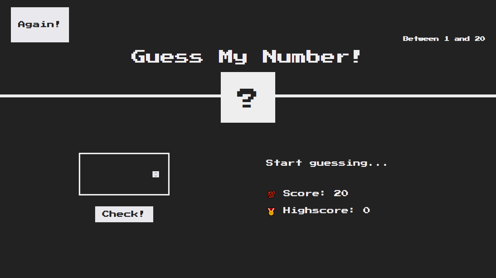

<h1 align="center">🎯 Guess My Number Game</h1>

<p align="center">
  A retro-style <b>number guessing game</b> built using <b>HTML, CSS, and Vanilla JavaScript</b>. <br/>
  Guess the secret number between <b>1 and 20</b> and try to achieve the highest score!
</p>

<p align="center">
  
  
  
</p>

---

## 📸 Preview

<p align="center">
  
</p>

---

## ✨ Features

- 🎲 Random number generation (1–20)
- ⌨️ Player input checking
- 📈 Instant hint system: Too High / Too Low
- 🏆 Score + Highscore tracking
- 🔄 Restart game anytime using **Again!**
- 🎨 Retro styled clean UI

---

## 🧠 JavaScript Learnings

This project helped me practice:

- DOM selection & manipulation (`querySelector`, `textContent`, `style`)
- Event handling using `addEventListener()`
- Game state management (`mysteryNumber`, `score`, `highScore`)
- Conditional logic for feedback messages
- Random number generation using:
  - `Math.random()`, `Math.trunc()`
- Code reusability using a helper function (`gameMessage()`)

---

## 🛠 Tech Stack

- HTML5
- CSS3
- JavaScript (Vanilla JS)

---

## 📂 Project Structure

```bash
guess-my-number-game/
│
├── index.html
├── README.md
│
├── assets/
│   └── preview.png
│
├── css/
│   └── style.css
│
└── js/
    └── script.js

🚀 Live Demo

👉 https://github.com/taffuwebx09/Guess-My-Number-Game

👨‍💻 Author

Tafajjul
```
